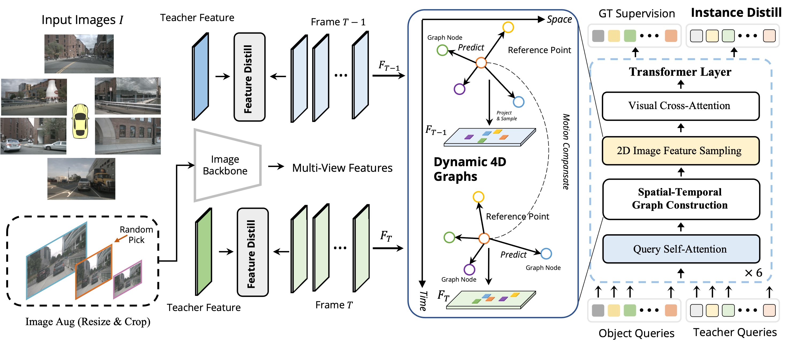

## Graph-DETR3D

> Graph-DETR3D: Rethinking Overlapping Regions for Multi-View 3D Object Detection
<a href="https://arxiv.org/abs/2204.11582">Arxiv Link</a>
<center>


</center>

## Performance

### Nuscenes Validation Set
| Model | mAP | NDS |
| -|-|-|
| DETR3D | 33.6 |  41.4  |
| Graph-DETR3D | 35.1 | 43.3 |


### Nuscenes Test Leaderboard
| Model | mAP | NDS |
| -|-|-|
| DETR3D | 41.2 |  47.9  |
| Graph-DETR3D | 42.5 | 49.5 |


## Citation
If you find our work useful for your research, please consider citing the paper
```
@article{chen2022graph,
  title={Graph-DETR3D: Rethinking Overlapping Regions for Multi-View 3D Object Detection},
  author={Chen, Zehui and Li, Zhenyu and Zhang, Shiquan and Fang, Liangji and Jiang, Qinhong and Zhao, Feng},
  journal={ACM MM},
  year={2022}
}
```